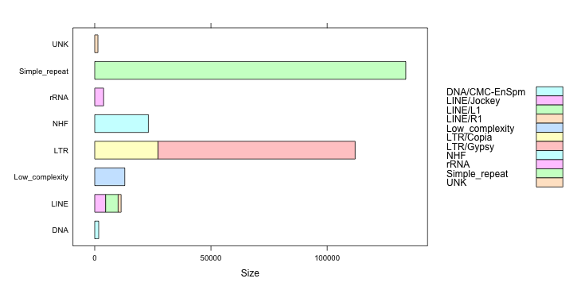
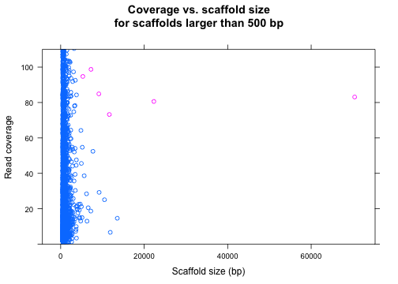
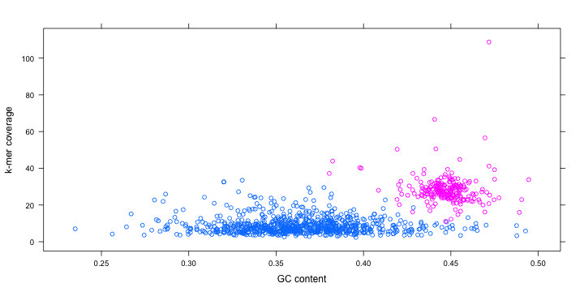

Shaun D Jackman, Anthony Raymond, Ben Vandervalk, Hamid Mohamadi,
René Warren, Stephen Pleasance, Robin Coope, Macaire MS Yuen,
Christopher Keeling, Carol Ritland, Jean Bousquet, Alvin Yanchuk,
Kermit Ritland, John MacKay, Steven JM Jones, Joerg C Bohlmann,
İnanç Birol

Abstract
========

The genome sequences of the plastid and mitochondrion of white spruce
(*Picea glauca*) are assembled from whole genome Illumina sequencing
data using ABySS. Whole genome sequencing data contains reads from
both the nuclear and organellar genomes. Reads of the organellar
genomes are abundant, because each cell contains hundreds of
mitochondria and plastids. One lane of MiSeq data assembles the 124
kbp plastid genome in a single scaffold, and one lane of HiSeq data
assembles a putative 6 Mbp mitochondrial genome. The raw assembly is
expected to be composed of organellar sequence as well as nuclear
repeat elements. The organellar sequences are separated from the
assembly by classifying the sequences using their length, depth of
coverage and GC content. The genes and repeats of the plastid and
mitochondrial genomes are annotated using MAKER-P.

Introduction
============

The SMarTForests project published the draft genome sequence of the
20 gigabase [white spruce (*Picea glauca*) genome][whitespruce], seven
times the size of the human genome, sequenced using the Illumina HiSeq
and MiSeq sequencing platforms. Whole genome sequencing data contains
reads originating from both the nuclear and organellar genomes.
Whereas one copy of the diploid nuclear genome is found in each cell,
hundreds of organelles are present, and thus hundreds of copies of the
organellar genomes. This abundance results in an overrepresentation of
the organellar genomes in whole genome sequencing data.

Assembling a single lane of whole genome sequencing data using
[ABySS][abyss] yields an assembly composed of organellar sequences and
nuclear repeat elements. The assembled sequences that originate from
the organellar genomes are separated from those of nuclear origin by
classifying the sequences using their length, depth of coverage and GC
content. The organellar genomes of white spruce are compared to those
of [Norway spruce (*Picea abies*)][norwayspruce].

Methods
=======

The software used in this analysis, their versions and the digital
object identifiers (DOI) of their respective publications are listed
in supplementary [table S1][].

Plastid
-------

### Assembly

The overlapping paired-end reads were merged using ABySS-mergepairs.
These merged reads were assembled using [ABySS][abyss]. Contigs that
are putatively derived from the plastid were separated by length and
depth of coverage using thresholds chosen by inspection (see
supplementary [figure S1][]). These putative plastid contigs were
assembled into scaffolds using ABySS-scaffold.

### Annotation

The assembled plastid genome was annotated using [DOGMA][dogma] with
default parameters (shown in supplementary [table S2][]).

### Comparative genomics

The assembled plastid genome was aligned to the
[Norway spruce][norwayspruce] complete plastid genome ([NC_021456][])
using [BWA-MEM][bwamem]. Coverage and identity of these alignments
were calculated using the script `bam-identity` (see supplementary
materials). The two genomes were compared using [QUAST][quast] to
confirm the presence of the annotated genes of the Norway spruce
plastid in the white spruce plastid.

[NC_021456]: http://www.ncbi.nlm.nih.gov/nuccore/NC_021456

Mitochondrion
-------------

### Assembly

ABySS-konnector was used to fill the gap between the paired-end reads
of a single lane of Illumina HiSeq sequencing of a paired-end library.
These connected paired-end reads were assembled using [ABySS][abyss].
Putative mitochondrial sequences were separated from the assembly by
their length, depth of coverage and GC content using k-means
clustering in R (see supplementary [figure S2][]). These putative
mitochondrial contigs were then assembled into scaffolds using
ABySS-scaffold with a single lane of Illumina HiSeq sequencing of a
mate-pair library.

### Annotation

The mitochondrial genome was annotated using [MAKER-P][maker]
(parameters shown in supplementary [table S3][]). The proteins of all
green plants (viridiplantae) with complete mitochondrial genome
sequences in NCBI GenBank, 51 species, were used for protein homology
evidence and aligned using [BLAST][blast] and [Exonerate][exonerate].
The [prince sago palm (Cycas taitungensis)
mitochondrion](ctaitungensis) ([NC_010303][]) is the closest related
species, being the only gymnosperm with a complete mitochondrial
genome. Transfer RNA (tRNA) were annotated using [tRNAscan][trnascan].
Ribosomal RNA (rRNA) were annotated using [Barrnap][barrnap]. Repeats
were identified using [RepeatMasker][repeatmasker] and RepeatModeler.

[NC_010303]: http://www.ncbi.nlm.nih.gov/nuccore/NC_010303

### Comparative genomics

The putative mitochondrial sequences of white spruce were aligned
to the putative mitochondrial sequences of the
[Norway spruce][norwayspruce] using [BWA-MEM][bwamem]. Coverage and
identity of these alignments were calculated using the script
`bam-identity` (see supplementary materials).

Results
=======

Table 1
-------

[table 1]: #table-1

**Table 1**: Sequencing, assembly and alignment metrics of the white
spruce organellar genomes

Metric                          |Plastid         |Mitochondrion
------------------------------- |--------------- |-------------
Number of lanes                 |1 MiSeq lane    |1 HiSeq lane
Number of read pairs            |4.7 million     |133 million
Read length                     |300 bp          |150 bp
Number of merged reads          |3.0 million     |1.4 million
Median merged read length       |492 bp          |465 bp
Number of assembled reads       |21 thousand     |377 thousand
Proportion of organellar reads  |1/140 or 0.7%   |1/350 or 0.3%
Depth of coverage               |80x             |30x
Assembled genome size           |125 kbp         |6.0 Mbp
Number of contigs†              |6 contigs       |223 contigs
Contig N50†                     |70 kbp          |39 kbp
Number of scaffolds             |1 scaffold      |78 scaffolds
Scaffold N50                    |125 kbp         |157 kbp
Largest scaffold                |125 kbp         |519 kbp
Identity to Norway spruce       |99.2%           |98.3%
Coverage of Norway spruce       |98.8%           |59.6%
Protein coding genes (mRNA)     |90              |54
Transfer RNA genes (tRNA)       |41              |27
Ribosomal RNA genes (rRNA)      |4               |4

† Permitting gaps less than 500 bp

Plastid
-------

### Assembly

The plastid genome was assembled into a single circular scaffold of
125 kbp with seven gaps. The assembly metrics are shown in
[table 1][].

### Annotation

The plastid genome contains 90 protein coding (mRNA) genes, 41
transfer RNA (tRNA) genes and 4 ribosomal RNA (rRNA) genes, shown in
[figure 1][].

<a name="figure-1"></a>
[figure 1]: #figure-1


**Figure 1**: The annotated plastid genome, which was annotated using
[DOGMA][dogma] and plotted using [OGDRAW][ogdraw].

### Comparative genomics

The genomes of the white spruce plastid and Norway spruce plastid show
perfect gene synteny with no structural rearrangements. All 117 genes
(114 in full and 3 partial) of the Norway spruce plastid genome
([NC_021456][]) are present in the white spruce plastid genome.

Mitochondrion
-------------

### Assembly

The mitochondrial genome was assembled into 78 scaffolds (223 contigs,
permitting gaps less than 500 bp) with a scaffold N50 of 157 kbp
(contig N50 of 39 kbp). The largest scaffold is 519 kbp. The assembly
metrics are shown in [table 1][].

### Annotation

The mitochondrial genome contains 54 protein coding (mRNA) genes, 27
transfer RNA (tRNA) genes and 4 ribosomal RNA (rRNA) genes, shown in
[figure 2][].

<a name="figure-2"></a>
[figure 2]: #figure-2


**Figure 2a**: The annotated mitochondrial genome, which was annotated
using [MAKER-P][maker] and plotted using [OGDRAW][ogdraw].


**Figure 2b**: The sizes of the mitochondrial genes, grouped by family

### Repeats

Repeats compose 391 kbp (6.5%) of the mitochondrial genome. Simple
repeats, the LINE Jockey and the LTR Copia and Gypsy are the most
common repeats, shown in [figure 3][].

<a name="figure-3"></a>
[figure 3]: #figure-3



**Figure 3**: Repetitive sequence of the mitochondrial genome

### Comparative genomics

The putative mitochondrial sequences of white spruce and Norway spruce
show high sequence similarity, over 98% nucleotide identity, but only
60% of the Norway spruce putative mitochondrial sequences are covered
by alignments of the white spruce sequences.

Conclusion
==========

One lane of MiSeq sequencing of whole genome DNA is sufficient to
assemble the 124 kbp complete plastid genome, and one lane of HiSeq
sequencing of whole genome DNA is sufficient to assemble a draft 6 Mbp
mitochondrial genome of white spruce. Scaffold contiguity is improved
with additional mate-pair library sequencing. The resulting assembly
of whole genome sequencing data is composed of organellar sequences as
well as high-copy-number nuclear repeat elements. The mitochondrial
sequences are separated using a k-means classifier based on their
length, depth of coverage and GC content of the sequences.

The white spruce plastid genome shows no structural rearrangements
when compared with Norway spruce. The mitochondrial genome in contrast
shows much structural rearrangement, though more work is needed to
determine what is due to the draft nature of these mitochondrial
assemblies and what is true structural rearrangement.

The protein coding gene content of the mitochondrial genome is quite
sparse, with 54 protein coding genes in 6 Mbp, in comparison to the
plastid genome, with 90 protein coding genes in 124 kbp. 7% of the
mitochondrial genome is composed of repeats, and 1% is composed of
genes. A significant portion, over 90%, of the unusually large size of
the white spruce mitochondrial genome is yet unexplained.

Acknowledgements
================

Shaun Jackman would like to thank his supervisors Inanc Birol and
Joerg Bohlmann for their guidance in the preparation of this
manuscript, and Carson Holt for being exceedingly responsive and
helpful in tweaking MAKER.

References
==========

+ [ABySS: a parallel assembler for short read sequence data][abyss]
+ [Horizontal Transfer of Entire Genomes via Mitochondrial Fusion in the Angiosperm Amborella][amborellamt]
+ [The Amborella Genome and the Evolution of Flowering Plants][amborellanuc]
+ [Genomic Clues to the Ancestral Flowering Plant][amborellaperspective]
+ [barrnap 0.4.2 - rapid ribosomal RNA prediction][barrnap]
+ [Basic Local Alignment Search Tool][blast]
+ [Aligning sequence reads, clone sequences and assembly contigs with BWA-MEM][bwamem]
+ [CGAP: a new comprehensive platform for the comparative analysis of chloroplast genomes][cgap]
+ [The Mitochondrial Genome of the Gymnosperm Cycas taitungensis Contains a Novel Family of Short Interspersed Elements, Bpu Sequences, and Abundant RNA Editing Sites][ctaitungensis]
+ [Automatic annotation of organellar genomes with DOGMA][dogma]
+ [Automated generation of heuristics for biological sequence comparison][exonerate]
+ [MAKER-P: a tool-kit for the rapid creation, management, and quality control of plant genome annotations][maker]
+ [The Norway spruce genome sequence and conifer genome evolution][norwayspruce]
+ [OrganellarGenomeDRAW (OGDRAW): a tool for the easy generation of high-quality custom graphical maps of plastid and mitochondrial genomes][ogdraw]
+ [Comparative chloroplast genomics reveals the evolution of *Pinaceae* genera and subfamilies][pinaceae]
+ [QUAST: quality assessment tool for genome assemblies][quast]
+ [Smit, AFA, Hubley, R & Green, P. RepeatMasker Open-3.0. 1996-2010 http://www.repeatmasker.org][repeatmasker]
+ [The Sequence Alignment/Map format and SAMtools][samtools]
+ [tRNAscan-SE: A Program for Improved Detection of Transfer RNA Genes in Genomic Sequence][trnascan]
+ [Assembling the 20Gb white spruce (*Picea glauca*) genome from whole-genome shotgun sequencing data][whitespruce]

[abyss]: http://genome.cshlp.org/content/19/6/1117
[amborellamt]: http://www.sciencemag.org/content/342/6165/1468
[amborellanuc]: http://www.sciencemag.org/content/342/6165/1241089
[amborellaperspective]: http://www.sciencemag.org/content/342/6165/1456
[barrnap]: http://www.vicbioinformatics.com/software.barrnap.shtml
[blast]: http://www.sciencedirect.com/science/article/pii/S0022283605803602
[bwamem]: http://arxiv.org/pdf/1303.3997.pdf
[cgap]: http://www.biomedcentral.com/1471-2105/14/95/abstract
[ctaitungensis]: http://mbe.oxfordjournals.org/content/25/3/603.short
[dogma]: http://bioinformatics.oxfordjournals.org/content/20/17/3252
[exonerate]: http://www.biomedcentral.com/1471-2105/6/31
[maker]: http://www.plantphysiol.org/content/early/2013/12/06/pp.113.230144
[norwayspruce]: http://www.nature.com/nature/journal/vaop/ncurrent/full/nature12211.html
[ogdraw]: http://nar.oxfordjournals.org/content/41/W1/W575
[pinaceae]: http://gbe.oxfordjournals.org/content/2/504
[quast]: http://bioinformatics.oxfordjournals.org/content/29/8/1072
[repeatmasker]: http://www.repeatmasker.org/
[samtools]: http://bioinformatics.oxfordjournals.org/content/25/16/2078
[trnascan]: http://nar.oxfordjournals.org/content/25/5/0955
[whitespruce]: http://bioinformatics.oxfordjournals.org/content/29/12/1492

--------------------------------------------------------------------------------

Supplementary material
======================

Figure S1: Classify plastid sequences
-------------------------------------

[figure S1]: #figure-s1-classify-plastid-sequences



**Figure S1**: Six plastid sequences were separated by length and
depth of coverage using thresholds chosen by inspection

Figure S2: Classify mitochondrial sequences
-------------------------------------------

[figure S2]: #figure-s2-classify-mitochondrial-sequences



**Figure S2**: Mitochondrial sequences were separated by length, depth
of coverage and GC content using k-means clustering in R

Table S1: Software
------------------

[table S1]: #table-s1-software

Software      | Version | DOI
--------------|---------|--------------------------
ABySS         | 1.3.7   | [10.1101/gr.089532.108][]
BLAST         | 2.2.29  | [10.1016/S0022-2836(05)80360-2][]
BWA           | 0.7.8   | [10.1093/bioinformatics/btp324][]
Barrnap       | 0.4.2   | NA
DOGMA         | NA      | [10.1093/bioinformatics/bth352][]
Exonerate     | 2.2.0   | [10.1186/1471-2105-6-31][]
HMMER         | 3.1b1   | [10.1371/journal.pcbi.1002195][]
MAKER-P       | 2.31.4  | [10.1104/pp.113.230144][]
QUAST         | 2.3     | [10.1093/bioinformatics/btt086][]
RECON         | 1.0.7   | [10.1101/gr.88502][]
RMBlast       | 2.2.28  | NA
RepeatMasker  | 4.0.5   | NA
RepeatModeler | 1.0.7   | NA
RepeatScout   | 1.0.5   | [10.1093/bioinformatics/bti1018][]
SAMtools      | 0.1.19  | [10.1093/bioinformatics/btp352][]
TRF           | 4.07b   | [10.1093/nar/27.2.573][]
tRNAscan-SE   | 1.23    | [10.1093/nar/25.5.0955][]

[10.1016/S0022-2836(05)80360-2]: http://dx.doi.org/10.1016/S0022-2836(05)80360-2
[10.1093/bioinformatics/bth352]: http://dx.doi.org/10.1093/bioinformatics/bth352
[10.1093/bioinformatics/bti1018]: http://dx.doi.org/10.1093/bioinformatics/bti1018
[10.1093/bioinformatics/btp324]: http://dx.doi.org/10.1093/bioinformatics/btp324
[10.1093/bioinformatics/btp352]: http://dx.doi.org/10.1093/bioinformatics/btp352
[10.1093/bioinformatics/btt086]: http://dx.doi.org/10.1093/bioinformatics/btt086
[10.1093/nar/25.5.0955]: http://dx.doi.org/10.1093/nar/25.5.0955
[10.1093/nar/27.2.573]: http://dx.doi.org/10.1093/nar/27.2.573
[10.1101/gr.089532.108]: http://dx.doi.org/10.1101/gr.089532.108
[10.1101/gr.88502]: http://dx.doi.org/10.1101/gr.88502
[10.1104/pp.113.230144]: http://dx.doi.org/10.1104/pp.113.230144
[10.1186/1471-2105-6-31]: http://dx.doi.org/10.1186/1471-2105-6-31
[10.1371/journal.pcbi.1002195]: http://dx.doi.org/10.1371/journal.pcbi.1002195

Table S2: DOGMA parameters
--------------------------

[table S2]: #table-s2-dogma-parameters

The following parameters were used for the annotation of the plastid
using [DOGMA][dogma].

Parameter                                        | Value
-------------------------------------------------|-------------
Genome type                                      | Chloroplast
Gapped alignment?                                | Yes
Genetic Code for Blastx                          | 11 Plant plastid
Percent identity cutoff for protein coding genes | 60
Percent identity cutoff for RNAs                 | 80
E-value                                          | 1e-5
Number of blast hits to return                   | 5

Table S3: MAKER parameters
--------------------------

[table S3]: #table-s3-maker-parameters

```
genome=pg29mt-concat.fa
organism_type=eukaryotic
protein=cds_aa.fa
model_org=picea
rmlib=rmlib.fa
repeat_protein=/usr/local/opt/maker/libexec/data/te_proteins.fasta
protein2genome=1
trna=1
other_gff=pg29mt-concat.rrna.gff
est_forward=1
single_exon=1
```
