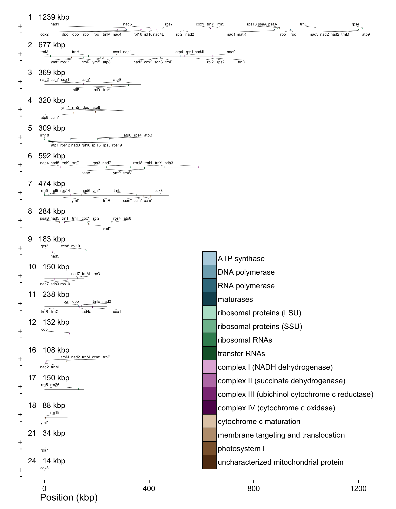
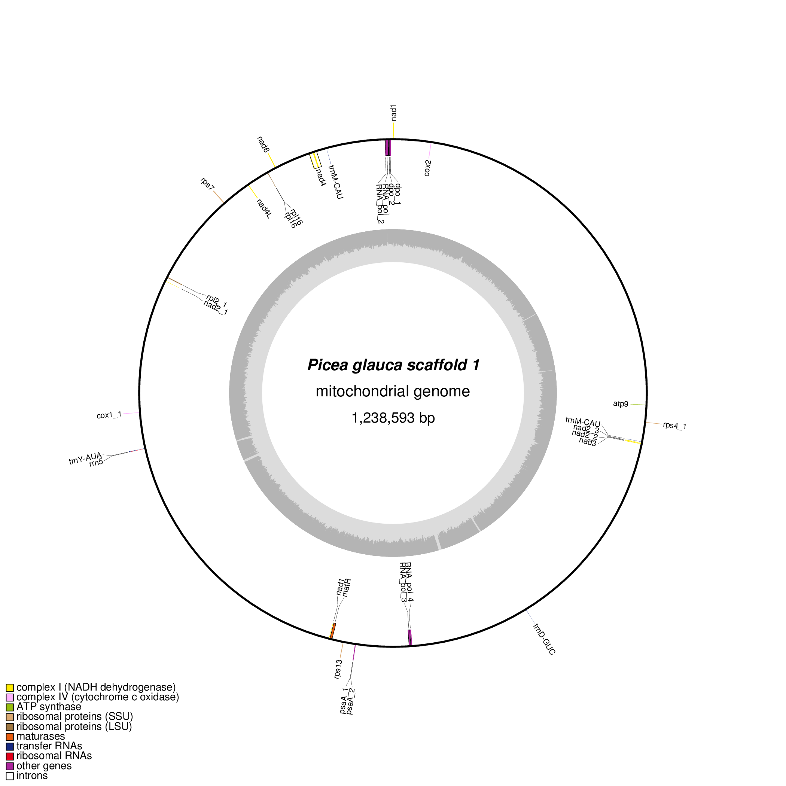

Figure S1: Classify plastid sequences
================================================================================


**Figure S1**: Six plastid sequences were separated by length and
depth of coverage using thresholds chosen by inspection

Figure S2: Classify mitochondrial sequences
================================================================================


**Figure S2**: Mitochondrial sequences were separated by length, depth
of coverage and GC content using k-means clustering in R

Figure S3: MUMmer alignment of the plastid
================================================================================


**Figure S3**: MUMmer was used to identify the inverted repeat of the plastid

Figure S4: The annotated white spruce mitochondrial genome
================================================================================



Figure S4: The white spruce mitochondrial genome, annotated using MAKER [@campbell2014maker] and Prokka [@seemann2014prokka] and plotted using OrganellarGenomeDRAW [@lohse2007organellargenomedraw].

Figure S5: The largest mitochondrial scaffold
================================================================================



Figure S5: The largest scaffold of the white spruce mitochondrial genome, annotated using MAKER and Prokka and plotted using OrganellarGenomeDRAW. This linear scaffold has been artificially circularized for this figure.

Table S1: Software
================================================================================

Software      | Version | DOI
--------------|---------|--------------------------
ABySS         | 1.3.7   | [10.1101/gr.089532.108][]
ARAGORN       | 1.2.36  | [10.1093/nar/gkh152][]
BEDTools      | 2.24.0  | [10.1093/bioinformatics/btq033][]
Biopython     | 1.65    | [10.1093/bioinformatics/btp163][]
BLAST         | 2.2.30  | [10.1016/S0022-2836(05)80360-2][]
BWA           | 0.7.12  | [10.1093/bioinformatics/btp324][]
Barrnap       | 0.5     | NA
DOGMA         | NA      | [10.1093/bioinformatics/bth352][]
Exonerate     | 2.2.0   | [10.1186/1471-2105-6-31][]
GenomeTools   | 1.5.5   | [10.1109/TCBB.2013.68][]
HMMER         | 3.1b2   | [10.1371/journal.pcbi.1002195][]
LINKS         | 1.1     | [10.1101/016519][]
MAKER         | 2.31.8  | [10.1104/pp.113.230144][]
MUMmer        | 3.23    | [10.1186/gb-2004-5-2-r12][]
OGDraw        | 1.1.1   | [10.1093/nar/gkt289][]
Prodigal      | 2.6.2   | [10.1186/1471-2105-11-119][]
Prokka        | 1.11    | [10.1093/bioinformatics/btu153][]
QUAST         | 2.3     | [10.1093/bioinformatics/btt086][]
RECON         | 1.0.7   | [10.1101/gr.88502][]
RMBlast       | 2.2.28  | NA
RepeatMasker  | 4.0.5   | NA
RepeatModeler | 1.0.8   | NA
RepeatScout   | 1.0.5   | [10.1093/bioinformatics/bti1018][]
RNAmmer       | 1.2     | [10.1093/nar/gkm160][]
Salmon        | 0.4.2   | [10.1038/nbt.2862][]
SAMtools      | 1.2     | [10.1093/bioinformatics/btp352][]
TRF           | 4.07b   | [10.1093/nar/27.2.573][]
tRNAscan-SE   | 1.23    | [10.1093/nar/25.5.0955][]

[10.1016/S0022-2836(05)80360-2]: http://dx.doi.org/10.1016/S0022-2836(05)80360-2
[10.1038/nbt.2862]: http://dx.doi.org/10.1038/nbt.2862
[10.1093/bioinformatics/bth352]: http://dx.doi.org/10.1093/bioinformatics/bth352
[10.1093/bioinformatics/bti1018]: http://dx.doi.org/10.1093/bioinformatics/bti1018
[10.1093/bioinformatics/btp163]: http://dx.doi.org/10.1093/bioinformatics/btp163
[10.1093/bioinformatics/btp324]: http://dx.doi.org/10.1093/bioinformatics/btp324
[10.1093/bioinformatics/btp352]: http://dx.doi.org/10.1093/bioinformatics/btp352
[10.1093/bioinformatics/btq033]: http://dx.doi.org/10.1093/bioinformatics/btq033
[10.1093/bioinformatics/btt086]: http://dx.doi.org/10.1093/bioinformatics/btt086
[10.1093/bioinformatics/btu153]: http://dx.doi.org/10.1093/bioinformatics/btu153
[10.1093/nar/25.5.0955]: http://dx.doi.org/10.1093/nar/25.5.0955
[10.1093/nar/27.2.573]: http://dx.doi.org/10.1093/nar/27.2.573
[10.1093/nar/gkh152]: htpp://dx.doi.org/10.1093/nar/gkh152
[10.1093/nar/gkm160]: http://dx.doi.org/10.1093/nar/gkm160
[10.1093/nar/gkt289]: http://dx.doi.org/10.1093/nar/gkt289
[10.1101/016519]: http://dx.doi.org/10.1101/016519
[10.1101/gr.089532.108]: http://dx.doi.org/10.1101/gr.089532.108
[10.1101/gr.88502]: http://dx.doi.org/10.1101/gr.88502
[10.1104/pp.113.230144]: http://dx.doi.org/10.1104/pp.113.230144
[10.1109/TCBB.2013.68]: http://dx.doi.org/10.1109/TCBB.2013.68
[10.1186/1471-2105-11-119]: http://dx.doi.org/10.1186/1471-2105-11-119
[10.1186/1471-2105-6-31]: http://dx.doi.org/10.1186/1471-2105-6-31
[10.1186/gb-2004-5-2-r12]: http://dx.doi.org/10.1186/gb-2004-5-2-r12
[10.1371/journal.pcbi.1002195]: http://dx.doi.org/10.1371/journal.pcbi.1002195

Table S1b: Data
================================================================================

Identifier    | Citation               | Name
--------------|------------------------|--------------------
[SRR525215][] | @birol2013assembling   | White spruce Illumina MiSeq paired end sequencing
[SRR525196][] | @birol2013assembling   | White spruce Illumina HiSeq 2000 paired end sequencing
[NC_010303][] | @chaw2008mitochondrial | Cycas taitungensis mitochondrion, complete genome
[NC_021456][] | @nystedt2013norway     | Picea abies chloroplast complete genome

[SRR525215]: http://www.ebi.ac.uk/ena/data/view/SRR525215
[SRR525196]: http://www.ebi.ac.uk/ena/data/view/SRR525196
[NC_010303]: http://www.ncbi.nlm.nih.gov/nuccore/NC_010303
[NC_021456]: http://www.ncbi.nlm.nih.gov/nuccore/NC_021456

Table S2: Plastid MAKER parameters
================================================================================

```bash
#-----Genome (these are always required)
genome=pg29-plastid.fa #genome sequence (fasta file or fasta embeded in GFF3 file)
organism_type=eukaryotic #eukaryotic or prokaryotic. Default is eukaryotic

#-----EST Evidence (for best results provide a file for at least one)
est=NC_021456.frn #set of ESTs or assembled mRNA-seq in fasta format

#-----Protein Homology Evidence (for best results provide a file for at least one)
protein=cds_aa.fa #protein sequence file in fasta format (i.e. from mutiple oransisms)

#-----Repeat Masking (leave values blank to skip repeat masking)
model_org=
repeat_protein=

#-----Gene Prediction
est2genome=1 #infer gene predictions directly from ESTs, 1 = yes, 0 = no
protein2genome=1 #infer predictions from protein homology, 1 = yes, 0 = no

#-----MAKER Behavior Options
est_forward=1 #map names and attributes forward from EST evidence, 1 = yes, 0 = no
single_exon=1 #consider single exon EST evidence when generating annotations, 1 = yes, 0 = no
single_length=50 #min length required for single exon ESTs if 'single_exon is enabled'
```

Table S3: Mitochondrion MAKER parameters
================================================================================

```bash
genome=pg29mt-scaffolds.fa
organism_type=eukaryotic
protein=cds_aa.fa
model_org=picea
rmlib=rmlib.fa
repeat_protein=/usr/local/opt/maker/libexec/data/te_proteins.fasta
protein2genome=1
est_forward=1
single_exon=1
```

Table S4: Mitochondrion scaffolding validation using MPET read alignments
================================================================================

LINKS Iteration#        Interval (kbp)       resulting scaffolds       starting scaffolds       merges       num gap       avg gap       sd gap       min gap       max gap       num overlap       avg overlap       sd overlap       min overlap       max overlap        #merges with MPET support       % MPET support       AVG #MPET pairs support
----------------------- -------------------- ------------------------- ------------------------ ------------ ------------- ------------- ------------ ------------- ------------- ----------------- ----------------- ---------------- ----------------- ----------------- -------------------------------- -------------------- ------------------------------
1                       1.75                 60                        61                       1            1             1165          0            1165          1165          0                 0                 0                                                    1                                100%                 25461
1                       5.5                  59                        60                       1            1             4814          0            4814          4814          0                 0                 0                                                    1                                100%                 14171
1                       6                    58                        59                       1            1             2699          0            2699          2699          0                 0                 0                                                    1                                100%                 36701
2                       0.5                  38                        58                       20           1             34            0            34            34            19                -337.74           117.18           -508              -130              20                               100%                 18692

Listing S1: GATK pipeline
================================================================================

This analysis used BWA 0.7.5a and samtools 0.1.18.

```sh
bwa index $ref
bwa aln -b1 -t12 -f libraryA_1.sai $ref $2
bwa aln -b2 -t12 -f libraryA_2.sai $ref $2
bwa sampe -f scrubb.sam $ref libraryA_1.sai libraryA_2.sai $2 $2
samtools view -hbS scrubb.sam > scrubb.bam
samtools sort scrubb.bam scrubb.sorted
samtools index scrubb.sorted.bam
samtools mpileup -u -f $ref -q 5 scrubb.sorted.bam | /scratch/seqdev/software/samtools/samtools-0.1.18/bcftools/bcftools view -cg - > scrubb.vcf
cat scrubb.vcf | awk '{ if (($1 ~ /\#/) || (($8 ~ /DP4=0,0/) && ($5 !~ /\./))) print $0 }' > scrubb-summary.vcf
/gsc/software/linux-x86_64-centos5/java-1.7.0-u13/bin/java -Xmx12g -jar /gsc/software/linux-x86_64-centos5/picard-tools-1.92/CreateSequenceDictionary.jar R=$ref O=$dict
/gsc/software/linux-x86_64-centos5/java-1.7.0-u13/bin/java -Xmx12g -jar /scratch/seqdev/software/GenomeAnalysisTK.jar \
  -R $ref \
  -T FastaAlternateReferenceMaker \
  -o $new \
  --variant scrubb-summary.vcf
```

Table S5: Counts of potential C-to-U RNA editing events per gene
================================================================================

|Name      | Size| C>U| Edits per 100 bp|
|:---------|----:|---:|----------------:|
|nad3      |  357|  32|        8.9635854|
|nad6      |  570|  47|        8.2456140|
|mttB      |  750|  61|        8.1333333|
|atp6      |  702|  55|        7.8347578|
|ccmC      |  720|  54|        7.5000000|
|ccmB      |  660|  49|        7.4242424|
|nad1      |  261|  19|        7.2796935|
|nad4a     |  525|  36|        6.8571429|
|cox3      |  798|  49|        6.1403509|
|cob       | 1188|  72|        6.0606061|
|nad9      |  528|  30|        5.6818182|
|cox1      | 1485|  84|        5.6565657|
|rps4      | 1053|  57|        5.4131054|
|rps1      |  687|  37|        5.3857351|
|sdh3      |  510|  27|        5.2941176|
|rps14     |  303|  16|        5.2805281|
|ccmFC2    |  537|  28|        5.2141527|
|rpl5      |  576|  29|        5.0347222|
|nad1      |  300|  15|        5.0000000|
|rps19-1   |  228|  11|        4.8245614|
|nad4L     |  498|  24|        4.8192771|
|atp9      |  249|  12|        4.8192771|
|atp4      |  603|  29|        4.8092869|
|rps2      |  720|  34|        4.7222222|
|ccmFN     | 1725|  79|        4.5797101|
|nad5      |  438|  20|        4.5662100|
|nad6_2    |  315|  14|        4.4444444|
|nad5      | 2452|  97|        3.9559543|
|rpl16     |  165|   6|        3.6363636|
|cox2      |  459|  16|        3.4858388|
|rps10     |  237|   8|        3.3755274|
|rps12     |  540|  18|        3.3333333|
|rpl10     |  483|  16|        3.3126294|
|nad2      |  717|  23|        3.2078103|
|rps11     |  513|  16|        3.1189084|
|ccmFC1    |  621|  19|        3.0595813|
|nad7_4    |  267|   8|        2.9962547|
|nad4_2    |  174|   5|        2.8735632|
|nad7_1    |  189|   5|        2.6455026|
|rps13     |  420|  11|        2.6190476|
|rps7      |  588|  15|        2.5510204|
|nad5      |  132|   3|        2.2727273|
|nad2      | 2075|  46|        2.2168675|
|cox2      |  429|   9|        2.0979021|
|nad7      | 1765|  35|        1.9830028|
|rpl2_4    |  213|   4|        1.8779343|
|rps3_2    |  246|   4|        1.6260163|
|nad1      |  609|   9|        1.4778325|
|cox1_1    |  342|   5|        1.4619883|
|matR      | 2145|  30|        1.3986014|
|psaA_2    |  303|   4|        1.3201320|
|nad2_5    |  267|   3|        1.1235955|
|rpl2_2    |  729|   8|        1.0973937|
|nad4      | 6532|  70|        1.0716473|
|rps3      | 6336|  58|        0.9154040|
|psaB      |  228|   2|        0.8771930|
|psaA_3    |  540|   4|        0.7407407|
|rps4_1    |  303|   2|        0.6600660|
|atp8      |  480|   3|        0.6250000|
|atp8      |  480|   3|        0.6250000|
|nad2_7    |  162|   1|        0.6172840|
|atp1-b    | 1524|   7|        0.4593176|
|rps3_3    |  228|   1|        0.4385965|
|atp8      |  480|   2|        0.4166667|
|ccmB      |  396|   1|        0.2525253|
|rpl2_1    |  582|   1|        0.1718213|
|dpo       | 2814|   2|        0.0710732|
|ymfatpA_4 | 1971|   1|        0.0507357|

Table S6: Counts of types of RNA-seq SNV in protein coding genes
================================================================================

| Ref | Alt | Count |
|-----|-----|------:|
| A   | C   |   11  |
| A   | G   |   19  |
| A   | T   |    4  |
| C   | A   |    8  |
| C   | G   |    6  |
| C   | T   | 1601  |
| G   | A   |   46  |
| G   | C   |    8  |
| G   | T   |   10  |
| T   | A   |    6  |
| T   | C   |   22  |
| T   | G   |   10  |

References
================================================================================
